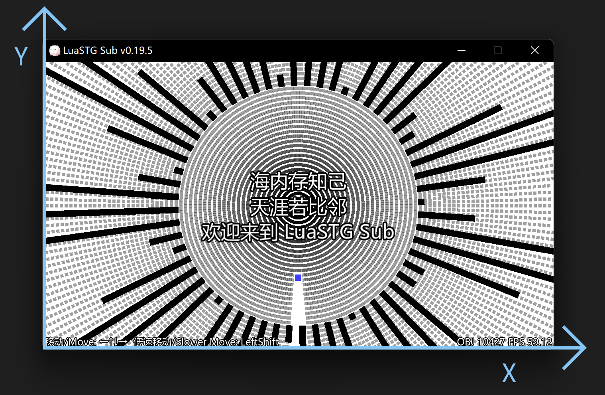

# Coordinate System

## Window Coordinate System

The origin of the window coordinate system of LuaSTG is located in the lower left corner of the client area of the window, the X axis is positive to the right, and the Y axis is positive upward.

Related API
* lstg.SetResolution
* lstg.EnumResolutions
* lstg.ChangeVideoMode
* lstg.GetMousePosition
* lstg.PostEffect

## Texture's Normalized UV Coordinate System

The origin of the normalized UV coordinate system of the texture is located in the upper left corner of the texture, the U-axis is positive to the right, and the V-axis is down. This is also the texture coordinate system used by various graphics APIs (OpenGL, Direct3D, Metal, Vulkan, etc.).

Related Content
* Post-processing effect shader (HLSL)

## Renderer's RenderTarget Coordinate System

The coordinate system used by the LuaSTG renderer when setting certain rendering states for the RenderTarget. The origin is at the lower left corner of the render target, the X-axis is positive to the right, and the Y-axis is positive up.

If no size is specified when creating a RenderTarget, the size of the RenderTarget is automatically synchronized to the size of the window, so at this time, it can be considered that the "Renderer's RenderTarget Coordinate System" and the "Window Coordinate System" are equal.

Related API
* lstg.CreateRenderTarget
* lstg.SetViewport
* lstg.SetScissorRect

## Renderer's Texture UV Coordinate System (Unit: Pixel)

LuaSTG's renderer sets the unit of the texture UV coordinate system of some APIs to pixels for convenience, rather than the normalized coordinate system of 0.0 to 1.0. The origin is located in the upper left corner of the texture, the U-axis is positive to the right, and the V-axis is down.

Related API
* lstg.RenderTexture
* lstg.GetTextureSize
* lstg.LoadImage
* lstg.LoadAnimation
* lstg.CurveLaser:Render

## Renderer's Custom 2D/3D Coordinate System

This part is quite free and completely customizable by the developer.

Setting The Coordinate System API
* lstg.SetOrtho
* lstg.SetPerspective

Using The Coordinate System API
* lstg.RenderRect
* lstg.Render
* lstg.RenderAnimation
* lstg.Render4V
* lstg.RenderTexture
* lstg.RenderText
* lstg.RenderTTF
* lstg.RenderModel
* lstg.DrawCollider
* lstg.RenderGroupCollider
* lstg.DefaultRenderFunc
* lstg.CurveLaser:Update
* lstg.CurveLaser:UpdateNode
* lstg.CurveLaser:UpdateAllNode
* lstg.CurveLaser:SetAllWidth
* lstg.CurveLaser:Render
* lstg.CurveLaser:RenderCollider

# 坐标系

## 窗口坐标系

LuaSTG 的窗口坐标系的原点位于窗口客户区的左下角，X 轴向右为正方向，Y 轴向上为正方向。

相关 API
* lstg.SetResolution
* lstg.EnumResolutions
* lstg.ChangeVideoMode
* lstg.GetMousePosition
* lstg.PostEffect

## 纹理的归一化 UV 坐标系

纹理的归一化 UV 坐标系原点位于纹理左上角，U 轴向右为正方向，V 轴向下为正方向。这也是各种图形 API 使用的纹理坐标系（OpenGL、Direct3D、Metal、Vulkan 等）。

相关内容
* 后处理特效着色器（HLSL）

## 渲染器的渲染目标坐标系

LuaSTG 的渲染器在针对渲染目标设置某些渲染状态的时候，使用的坐标系。原点位于渲染目标的左下角，X轴向右为正方向，Y轴向上为正方向。

如果创建渲染目标时没有指定大小，那么渲染目标的大小会自动同步为窗口的大小，因此这时候可以认为“渲染器的渲染目标坐标系”与“窗口坐标系”是相等的。

相关 API
* lstg.CreateRenderTarget
* lstg.SetViewport
* lstg.SetScissorRect

## 渲染器的纹理 UV 坐标系（单位：像素）

LuaSTG 的渲染器为了方便使用，将一部分 API 的纹理 UV 坐标系的单位设定为像素，而不是 0.0 到 1.0 的归一化坐标系。原点位于纹理左上角，U 轴向右为正方向，V 轴向下为正方向。

相关 API
* lstg.RenderTexture
* lstg.GetTextureSize
* lstg.LoadImage
* lstg.LoadAnimation
* lstg.CurveLaser:Render

## 渲染器的自定义 2D/3D 坐标系

这部分相当自由，完全由开发者自定义。

设置坐标系的 API
* lstg.SetOrtho
* lstg.SetPerspective

使用坐标系的 API
* lstg.RenderRect
* lstg.Render
* lstg.RenderAnimation
* lstg.Render4V
* lstg.RenderTexture
* lstg.RenderText
* lstg.RenderTTF
* lstg.RenderModel
* lstg.DrawCollider
* lstg.RenderGroupCollider
* lstg.DefaultRenderFunc
* lstg.CurveLaser:Update
* lstg.CurveLaser:UpdateNode
* lstg.CurveLaser:UpdateAllNode
* lstg.CurveLaser:SetAllWidth
* lstg.CurveLaser:Render
* lstg.CurveLaser:RenderCollider
