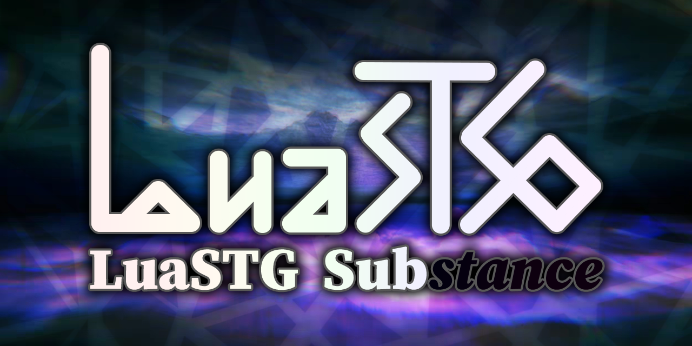

# LuaSTG Sub  

---

## Introduce

LuaSTG Sub, is a branch that the basic functions migrated to the new system API, target to replace the legacy [LuaSTG Plus](https://github.com/9chu/LuaSTGPlus/tree/legacy) and [LuaSTG Ex Plus](https://github.com/Legacy-LuaSTG-Engine/Legacy-LuaSTG-Ex-Plus) branch.

Other branches are listed on the homepage of the [Legacy LuaSTG Engine organization](https://github.com/Legacy-LuaSTG-Engine).

## Download

You can download from [Releases Page](https://github.com/Legacy-LuaSTG-Engine/LuaSTG-Sub/releases). Usually displayed on the right or bottom (mobile GitHub page).  
In addition, there are development tools and libraries such as THlib, LuaSTG Sharp Editor (GUI Editor) available for download: [LuaSTG aex+](https://files.luastg-sub.com)

> THlib: A set of official Touhou Project games style scripts and resources libraries, including stage backgrounds library, player library, bullet library, SpellCard system, stage group, replay system, etc., which may be more familiar to more people is "东方弹幕祀典"

> Note: THlib contains the resources from the official Touhou Project games, as well as some resources with unknown sources and copyrights, which are only for reference and learning.

## Major Migration Content

* Graphic API: Direct3D 9 to Direct3D 11
* Audio API: DirectSound to XAudio2

## Requirements

* Operating System: Windows 7 SP1 with platform update ([KB2670838](https://www.microsoft.com/en-us/download/details.aspx?id=36805)) or above
* Graphics Card: compatible with Direct3D11, Direct3D feature level is D3D_FEATURE_LEVEL_10_0 or above
* Audio Card: compatible with XAudio2

## Build Projects

See [Build Projects](./BUILD.md).

## Project and Maintainer Status

### Project

This project was archived for two months in 2025, but due to strong requests from several developers, we unarchived it and resumed providing security updates and bug fixes.

We will continue maintaining the LuaSTG Sub engine. However, due to a shortage of maintainers or their limited availability, we will prioritize fixing bugs that severely impact usability.

### Maintainer Status

The primary maintainers of LuaSTG Sub are all occupied with their jobs, often resulting in periods of several months with no code contributions. Some maintainers, due to workplace restrictions, are unable to contribute code to projects "owned by individuals or external organizations".

- 隔壁的桌子: No longer involved in LuaSTG engine development  
- 9chu: Unknown  
- ESC: No longer involved in LuaSTG engine development  
- Xiliusha: Unable to participate in software development due to health issues  
- 璀境石: Work schedule is Monday through Saturday, 9:00 AM to 9:00 PM, also frequently required to work overtime on Sundays.  

## Major Contributors

- 隔壁的桌子 (developer of vanilla LuaSTG)  
- [9chu](https://github.com/9chu) (developer of LuaSTG Plus)  
- [ESC](https://github.com/ExboCooope) (developer of LuaSTG Ex Plus)  
- [Xiliusha](https://github.com/Xiliusha) (developer of LuaSTG Ex Plus)  
- [璀境石](https://github.com/Demonese) (developer of LuaSTG Sub)  

---

## 介绍  

LuaSTG Sub 分支的基础功能被迁移到新的系统 API，用于替代老旧的 [LuaSTG Plus](https://github.com/9chu/LuaSTGPlus/tree/legacy) 和 [LuaSTG Ex Plus](https://github.com/Legacy-LuaSTG-Engine/Legacy-LuaSTG-Ex-Plus)。  

其他分支收录在 [Legacy LuaSTG Engine 组织首页](https://github.com/Legacy-LuaSTG-Engine)。  

## 下载  

你可以从 [Releases 页面](https://github.com/Legacy-LuaSTG-Engine/LuaSTG-Sub/releases) 下载，一般显示在右侧或者底部（手机版页面）。  
此外，还有配套的 THlib、弹幕编辑器等开发工具可供下载：[LuaSTG aex+](https://files.luastg-sub.com)  

> THlib：一套东方原作风格的脚本和素材库，包含关卡背景库、自机库、子弹库、符卡系统、关卡组、replay 系统等，可能被更多人更熟悉的是“东方弹幕祀典”  

> 注意：THlib 含有东方 Project 官方作品的素材，以及一些来源和版权不明的素材，仅供参考学习使用  

## 主要迁移内容  

* 图形 API：从 Direct3D 9 迁移到 Direct3D 11  
* 音频 API：从 DirectSound 迁移到 XAudio2  

## 配置要求  

* 系统要求：最低为 Windows 7 SP1 且安装平台更新（[KB2670838](https://www.microsoft.com/en-us/download/details.aspx?id=36805)）  
* 显卡需求：支持 Direct3D 11 且 Direct3D 功能级别至少为 D3D_FEATURE_LEVEL_10_0  
* 声卡需求：支持 XAudio2  

## 编译项目  

请阅读[编译项目](./BUILD.md)。

## 项目和维护者状态  

### 项目

该项目曾在 2025 年归档了两个月，但在一些开发者的强烈要求下，我们取消了归档并进行安全更新和BUG修复。

我们仍然会继续维护 LuaSTG Sub 引擎，但由于缺乏维护者，或者维护者缺少空闲时间，我们将优先修复严重影响使用的BUG。

### 维护者状态

LuaSTG Sub 的主要维护者们都忙于工作，经常出现长达几个月没有任何代码提交的情况。其中有些维护者由于工作安排上的限制，无法向“属于个人或外部组织”的项目提交代码。

- 隔壁的桌子：不再参与 LuaSTG 引擎开发  
- 9chu：未知  
- ESC：不再参与 LuaSTG 引擎开发  
- Xiliusha：由于疾病影响，无法再参与程序开发  
- 璀境石：工作时间周一到周六，9:00 到 21:00，在周日也经常被要求加班  

## 主要贡献者  

- 隔壁的桌子（LuaSTG 开发者）  
- [9chu](https://github.com/9chu)（LuaSTG Plus 开发者）  
- [ESC](https://github.com/ExboCooope)（LuaSTG Ex Plus 开发者）  
- [Xiliusha](https://github.com/Xiliusha)（LuaSTG Ex Plus 开发者）  
- [璀境石](https://github.com/Demonese)（LuaSTG Sub 开发者）  
